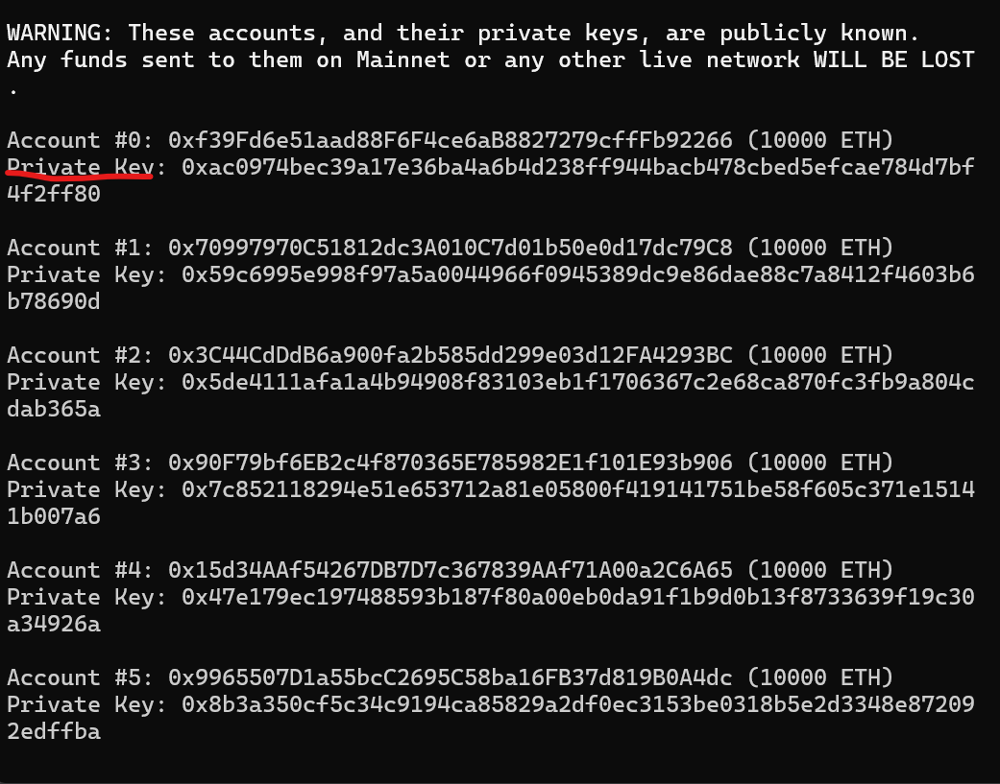
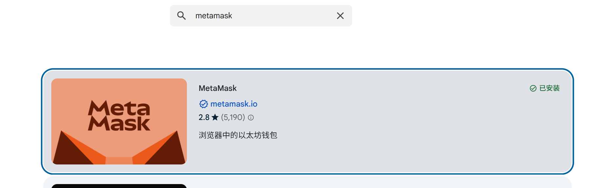
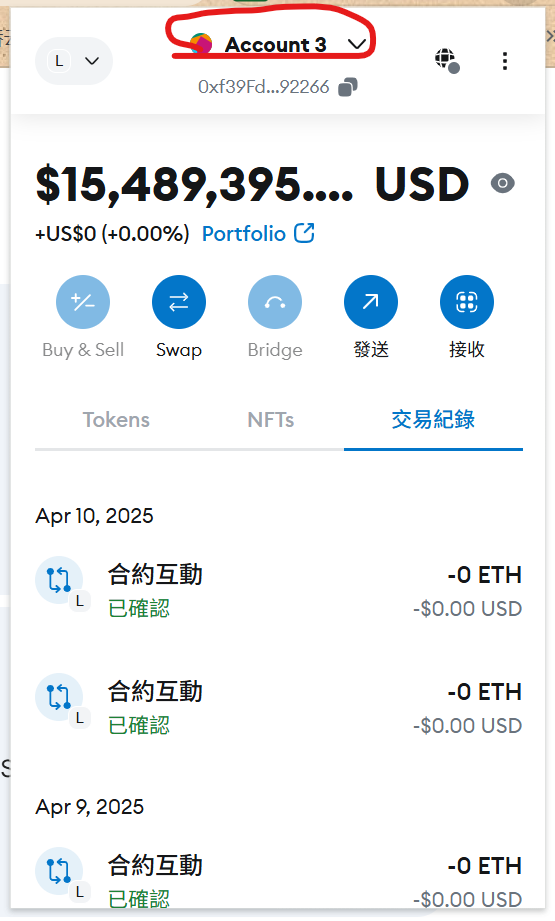
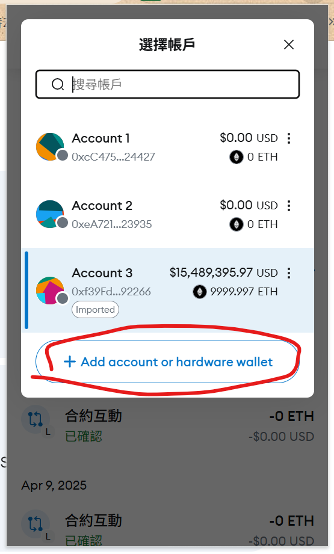
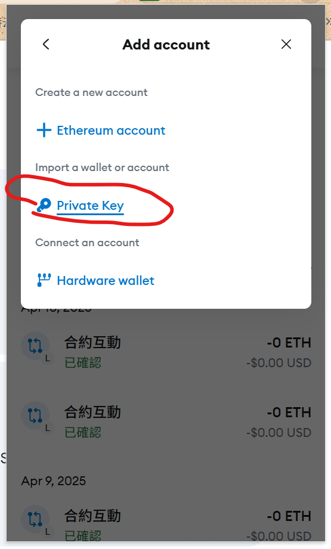
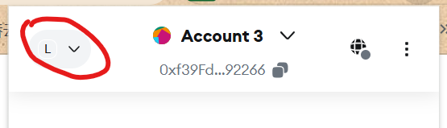
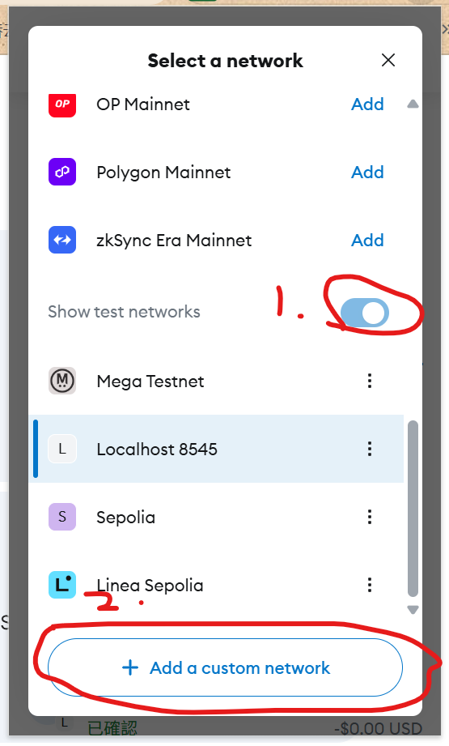
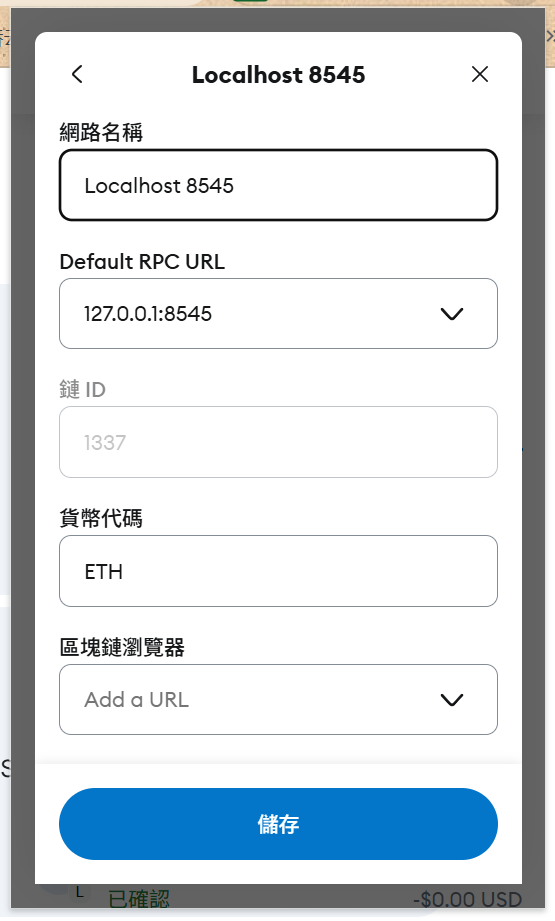

# LAN-Chat

LAN-Chat 是一个基于 WebRTC 和 WebSocket 的局域网聊天应用，支持文本消息、点对点通信和多用户聊天室，通过metamask完成了(DID去中心化标识符)功能，通过pinata完成了IPFS(分布式存储的功能)，用Hardhat完成了消息上链的功能。

## 功能特点

- **局域网通信**：无需互联网连接，在局域网内即可使用
- **多设备支持**：局域网内设备均可
- **实时消息**：基于 WebSocket 的实时消息传递
- **点对点通信**：使用 WebRTC 进行直接的点对点通信
- **多用户聊天**：支持多人同时在线聊天
- **隐私问题**：无需担心隐私问题，数据均为点对点传输
- **文件传输**：支持点对点文件在线传输
- **响应式设计**：适配桌面和移动设备
- **深色/浅色主题**：支持主题切换
- **（待续）**

## 技术栈

### 前端

- Vue 3 (Composition API)
- TypeScript
- Vite
- Pinia (状态管理)
- Socket.io-client (WebSocket 客户端)
- WebRTC (点对点通信)
- TailwindCSS (样式)
- **（待续）**

### 后端

- Node.js
- Express
- TypeScript
- Socket.io (WebSocket 服务器)
- Winston (日志)
- **（待续）**

## 快速开始

### 前提条件

- Node.js 18+
- npm 或 yarn
- metamask账户
- pinata账号
- **（待续）**

### 安装和运行

    0.配置pinata信息
    在server/.env.pinataconfig.public填写自己pinata workspace的信息


1. 克隆仓库

```bash
git clone https://github.com/mshinay/LAN-Chat-c4
cd LAN-Chat-c4
```

2. 安装依赖并启动后端

```bash
cd server
npm install
npm run dev
```

3. 安装依赖并启动前端

```bash
cd ../chat
npm install
npm run dev
```

4.按照合约依赖
```bash
cd ../ipfs-contract
npm install
```

4.1启动合约本地节点
```bash
cd contracts
npx hardhat node
```

4.2部署合约到本地网络（使用另一个cmd）
```bash
npx hardhat run scripts/deploy.js --network localhost
```

5. 在浏览器中访问

```
http://localhost:5173
```

### 关于hardhat本地网络
在启动合约本地节点后（4.1），cmd会出现20个钱包账户，将其Private Key导入进meatmask里就可以用账户里的测试币进行上链功能


### 关于metamask

#### 1.在Chrome Firefox Edge等浏览器里下载metamask插件


#### 2.按照教程注册一个用户

#### 3.导入hardhat本地账户密钥




#### 4.添加并切换hardhat本地网络



##### 本地网络数据如下



| 字段                | 值                          |
|---------------------|-----------------------------|
| Network name        | `Hardhat Local` (可自定义)   |
| New RPC URL         | `http://127.0.0.1:8545`      |
| Chain ID            | `1337` (Hardhat 默认链ID)   |
| Currency symbol     | `ETH` (或其他自定义代币符号)  |
| Block explorer URL  | 留空（本地网络无需浏览器）      |

### 项目部署（这个不用看）

```bash
cd LAN-Chat/chat
npm install
cd ../server
npm install
npm run start
```

## 许可证

MIT
